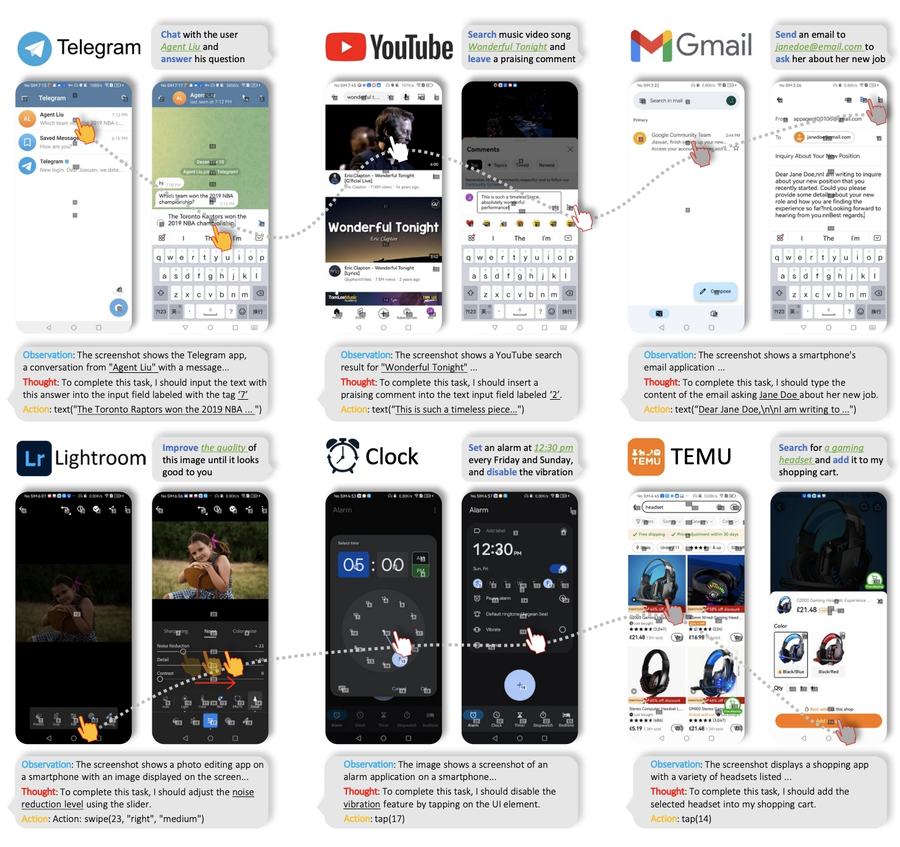
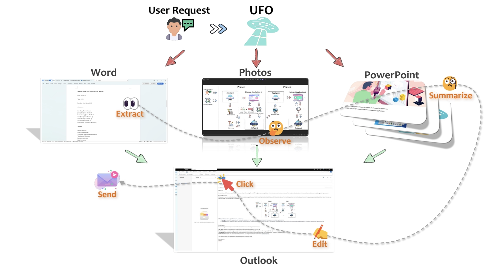

# Awesome UI Agent

[](https://github.com/sindresorhus/awesome)

[](https://twitter.com/opendilab)    
[](https://github.com/opendilab/awesome-ui-agents/stargazers)
[](https://github.com/opendilab/awesome-ui-agents/network)

[](https://github.com/opendilab/awesome-ui-agents/issues)
[](https://github.com/opendilab/awesome-ui-agents/pulls)
[](https://github.com/opendilab/awesome-ui-agents/graphs/contributors)
[](https://opensource.org/licenses/Apache-2.0)

This is a collection of research papers for **UI Agent**, which includes models, tools, and datasets.
And the repository will be continuously updated to track the frontier of UI Agent or related fields.

Welcome to follow and star!

## Table of Contents

- [Awesome UI Agent](#awesome-ui-agent)
  - [Table of Contents](#table-of-contents)
  - [Overview of UI Agent](#overview-of-ui-agent)
  - [Papers](#papers)
    - [Models](#models)
      - [2025](#2025)
      - [2024](#2024)
      - [2023](#2023)
    - [Tools](#tools)
    - [Datasets](#datasets)
  - [Related Repositories](#related-repositories)
  - [Contributing](#contributing)
  - [License](#license)

## Overview of UI Agent

UI Agent aims to build a generalist agent that can interact with various user interfaces (UIs) in different environments, such as mobile apps, web pages, and PC applications. The agent can understand the UIs through vision-language models and interact with them to complete tasks. The agent can be applied to various scenarios, such as mobile device operation, web browsing, and game playing. The agent can be trained in a simulated environment or with real-world data. The agent can be evaluated in terms of task completion rate, efficiency, and generalization ability.

<p align="center">
  
</p>

The research on UI Agent is still in its early stage, and there are many challenges to be addressed, such as the scalability of the agent, the robustness of the agent, and the interpretability of the agent. The research on UI Agent is interdisciplinary, involving computer vision, natural language processing, reinforcement learning, human-computer interaction, and software engineering. The research on UI Agent has the potential to revolutionize the way we interact with computers and improve the efficiency and usability of computer systems.

<p align="center">
  
</p>

## Papers

```
format:
- [title](paper link) [links]
    - author1, author2, and author3...
    - year
    - publisher
    - key 
    - code 
    - experiment environment
```

### Models

#### 2025

- [OpenAI operator](https://openai.com/index/introducing-operator/)  
  - OpenAI 
  - Key: A research preview of an agent that can use its own browser to perform tasks for you.  
  - ExpEnv: OSWorld, WebArena, WebVoyager

- [OpenAI Computer-Using Agent](https://openai.com/index/computer-using-agent/)  
  - OpenAI 
  - Key: a universal interface for AI to interact with the digital world. 
  - ExpEnv: OSWorld, WebArena, WebVoyager

- [Claude computer use](https://www.anthropic.com/news/developing-computer-use)  
  - anthropic 
  - Key: emulating the way people interact with their own computer. 
  - ExpEnv: OSWorld

- [Multi-modal Agent Tuning: Building a VLM-Driven Agent for Efficient Tool Usage](https://openreview.net/forum?id=0bmGL4q7vJ)  
  - Zhi Gao, Bofei Zhang, Pengxiang Li, Xiaojian Ma, Tao Yuan, Yue Fan, Yuwei Wu, Yunde Jia, Song-Chun Zhu, Qing Li  
  - Key: Multimodal Agents, Vision-language Model, Tool usage  
  - ExpEnv: GTA, GAIA benchmarks

- [Lightweight Neural App Control](https://openreview.net/forum?id=BL4WBIfyrz)  
  - Filippos Christianos, Georgios Papoudakis, Thomas Coste, Jianye HAO, Jun Wang, Kun Shao  
  - Key: vision-language model, multi-modal, android control, app agent  
  - ExpEnv: two open-source mobile control datasets
  
- [Enhancing Software Agents with Monte Carlo Tree Search and Hindsight Feedback](https://openreview.net/forum?id=G7sIFXugTX)  
  - Antonis Antoniades, Albert Örwall, Kexun Zhang, Yuxi Xie, Anirudh Goyal, William Yang Wang  
  - Key: agents, LLM, SWE-agents, SWE-bench, search, planning, reasoning, self-improvement, open-ended  
  - ExpEnv: SWE-bench

#### 2024

- [On the Effects of Data Scale on UI Control Agents](https://arxiv.org/abs/2406.03679)  
    - Wei Li, William Bishop, Alice Li, Chris Rawles, Folawiyo Campbell-Ajala, Divya Tyamagundlu, Oriana Riva  
    - Key: Autonomous agents, UI control, AndroidControl dataset, fine-tuning, in-domain vs out-of-domain performance  
    - 2024
    - [code](https://github.com/google-research/google-research/tree/master/android_control)

- [SWE-agent: Agent-Computer Interfaces Enable Automated Software Engineering](https://arxiv.org/abs/2405.15793)
    - John Yang, Carlos E. Jimenez, Alexander Wettig, Kilian Lieret, Shunyu Yao, Karthik Narasimhan, Ofir Press
    - Key: Language model agents, agent-computer interface (ACI), automated software engineering, SWE-bench, HumanEvalFix
    - 2024
    - [code](https://github.com/SWE-agent/SWE-agent)

- [Embodied Agent Interface: Benchmarking LLMs for Embodied Decision Making](https://arxiv.org/abs/2410.07166)
    - Manling Li, Shiyu Zhao, Qineng Wang, Kangrui Wang, Yu Zhou, Sanjana Srivastava, Cem Gokmen, Tony Lee, Li Erran Li, Ruohan Zhang, Weiyu Liu, Percy Liang, Li Fei-Fei, Jiayuan Mao, Jiajun Wu
    - Key: Large language models, embodied decision making, generalized interface, fine-grained metrics, subgoal decomposition, action sequencing
    - 2024
    - [code](https://github.com/embodied-agent-eval/embodied-agent-eval)

- [Cradle: Empowering Foundation Agents Towards General Computer Control](https://arxiv.org/abs/2403.03186)
    - Weihao Tan and Wentao Zhang and Xinrun Xu and Haochong Xia and et al.
    - Key:  various virtual scenarios, General Computer Control
    - 2024
    - [code](https://github.com/BAAI-Agents/Cradle)

- [Lightweight Neural App Control](https://arxiv.org/abs/2410.17883)
    - Filippos Christianos and Georgios Papoudakis and Thomas Coste and Jianye Hao and Jun Wang and Kun Shao
    - KEY: app agents,  Android apps, Action Transformer
    - 2024
    
- [SeeAct GPT-4V(ision) is a Generalist Web Agent, if Grounded](https://github.com/OSU-NLP-Group/SeeAct)
    - Boyuan Zheng and Boyu Gou and Jihyung Kil and Huan Sun amd Yu Su
    - Key: live websites, grounding still, mage captioning, visual question answering
    - 2024
    - [code](https://osu-nlp-group.github.io/SeeAct)

- [MMAC-Copilot: Multi-modal Agent Collaboration Operating System Copilot](https://arxiv.org/abs/2404.18074)
    - Zirui Song and Yaohang Li and Meng Fang and Zhenhao Chen and Zecheng Shi and Yuan Huang and Ling Chen
    - Key: Autonomous virtual agents, Multi-Modal Agent Collaboration
    - 2024

- [SeeClick: Harnessing GUI Grounding for Advanced Visual GUI Agents](https://arxiv.org/abs/2401.10935)
    - Kanzhi Cheng and Qiushi Sun and Yougang Chu and Fangzhi Xu and Yantao Li and Jianbing Zhang and Zhiyong Wu
    - Key: Graphical User Interface, screenshots
    - 2024
    -[code](https://github.com/njucckevin/SeeClick)

- [OS-ATLAS: A Foundation Action Model for Generalist GUI Agents](https://arxiv.org/abs/2410.23218)
    - Zhiyong Wu and Zhenyu Wu and Fangzhi Xu and Yian Wang and Qiushi Sun and Chengyou Jia and Kanzhi Cheng and Zichen Ding and Liheng Chen and Paul Pu Liang and Yu Qiao
    - Key: Out-Of-Distribution, GUI grounding, language agent
    - 2024
    -[code](https://github.com/OS-Copilot/OS-Atlas)

- [Proposer-Agent-Evaluator(PAE): Autonomous Skill Discovery For Foundation Model Internet Agents](https://arxiv.org/abs/2412.13194)
    - Yifei Zhou and Qianlan Yang and Kaixiang Lin and Min Bai and Xiong Zhou and Yu-Xiong Wang and Sergey Levine and Erran Li
    - Key: Large language models,  Internet-browsing agent, autonomous task proposal 
    - 2024
    - [code](https://yanqval.github.io/PAE/)

- [Autowebglm: Bootstrap and reinforce a large language model-based web navigating agent](https://arxiv.org/abs/2404.03648)
    - Hanyu Lai and Xiao Liu and Iat Long Iong and Shuntian Yao and Yuxuan Chen and Pengbo Shen and Hao Yu and Hanchen Zhang and Xiaohan Zhang and Yuxiao Dong and Jie Tang
    - Key: Large language models, real-world web navigation, bilingual benchmark 
    - 2024
    - [code](https://github.com/THUDM/AutoWebGLM)
  
- [Dual-view visual contextualization for web navigation](https://arxiv.org/abs/2402.04476)
    - Jihyung Kil and Chan Hee Song and Boyuan Zheng and Xiang Deng and Yu Su and Wei-Lun Chao
    - Key: Automatic web navigation, language instructions, HTML elements
    - 2024

- [Agent-e: From autonomous web navigation to foundational design principles in agentic systems](https://arxiv.org/abs/2407.13032)
    - Hanyu Lai and Xiao Liu and Iat Long Iong and Shuntian Yao and Yuxuan Chen and Pengbo Shen and Hao Yu and Hanchen Zhang and Xiaohan Zhang and Yuxiao Dong and Jie Tang
    - Key: hierarchical architecture, flexible DOM distillation, denoising method
    - 2024
    - [code](https://github.com/EmergenceAI/Agent-E)

- [Tree search for language model agents](https://arxiv.org/abs/2407.01476)
    - Jing Yu Koh and Stephen McAleer and Daniel Fried and Ruslan Salakhutdinov
    - Key: multi-step reasoning, planning, best-first tree search 
    - 2024
    - [code](https://github.com/kohjingyu/search-agents)

- [Agent S: an open agentic framework that uses computers like a human](https://arxiv.org/abs/2410.08164)
    - Saaket Agashe and Jiuzhou Han and Shuyu Gan and Jiachen Yang and Ang Li and Xin Eric Wang
    - Key: Multimodal Large Language Models, Graphical User Interface, Agent-Computer Interface
    - 2024
    - [code](https://github.com/simular-ai/Agent-S)

- [Apple Intelligence Foundation Language Models](https://arxiv.org/pdf/2407.21075)
    - Apple
    - Key: Vision-Language Model, Private Cloud Compute
    - 2024

- [CoCo-Agent: A Comprehensive Cognitive MLLM Agent for Smartphone GUI Automation](https://arxiv.org/abs/2402.11941)
    - Xinbei Ma and Zhuosheng Zhang and Hai Zhao
    - Key: Vision-Language Model, Phone
    - 2024
    - [code](https://github.com/xbmxb/CoCo-Agent)

- [SeeClick: Harnessing GUI Grounding for Advanced Visual GUI Agents](https://arxiv.org/abs/2401.10935)
    - Kanzhi Cheng and Qiushi Sun and Yougang Chu and Fangzhi Xu and Yantao Li and Jianbing Zhang and Zhiyong Wu
    - Key: Vision-Language Model, PC
    - 2024
    - [code](https://github.com/njucckevin/SeeClick)

- [Intention-inInteraction (IN3): Tell Me More! Towards Implicit User Intention Understanding of Language Model Driven Agents](https://arxiv.org/abs/2402.09205)
    - Cheng Qian and Bingxiang He and Zhong Zhuang and Jia Deng and Yujia Qin and Xin Cong and Zhong Zhang and Jie Zhou and Yankai Lin and Zhiyuan Liu and Maosong Sun
    - Key: Language Model, User Intention
    - 2024
    - [code](https://github.com/OpenBMB/Tell_Me_More)

- [LATS: Language Agent Tree Search Unifies Reasoning Acting and Planning in Language Models](https://arxiv.org/abs/2406.11896)
    - Andy Zhou and Kai Yan and Michal Shlapentokh-Rothman and Haohan Wang and Yu-Xiong Wang
    - Key: Tree Search, Language Model
    - 2024
    - [code](https://github.com/lapisrocks/LanguageAgentTreeSearch)

- [DigiRL: Training In-The-Wild Device-Control Agents with Autonomous Reinforcement Learning](https://arxiv.org/abs/2406.11896)
    - Hao Bai and Yifei Zhou and Mert Cemri and Jiayi Pan and Alane Suhr and Sergey Levine and Aviral Kumar
    - Key: Vision-Language Model, Android, Reinforcement Learning
    - 2024
    - [code](https://github.com/DigiRL-agent/digirl)

- [ScreenAI: A Vision-Language Model for UI and Infographics Understanding](https://arxiv.org/abs/2402.04615)
    - Gilles Baechler and Srinivas Sunkara and Maria Wang and Fedir Zubach and Hassan Mansoor and Vincent Etter and Victor Cărbune and Jason Lin and Jindong Chen and Abhanshu Sharma
    - Key: Vision-Language Model, Mobile, Infographics
    - 2024
    -[code](https://github.com/kyegomez/ScreenAI)

- [ScreenAgent: A Vision Language Model-driven Computer Control Agent](https://arxiv.org/abs/2402.07945)
    - Runliang Niu and Jindong Li and Shiqi Wang and Yali Fu and Xiyu Hu and Xueyuan Leng and He Kong and Yi Chang and Qi Wang
    - Key: Vision Language Model, PC
    - 2024
    - [code](https://github.com/niuzaisheng/ScreenAgent)

- [Android in the Zoo: Chain-of-Action-Thought for GUI Agents](https://arxiv.org/abs/2403.02713)
    - Jiwen Zhang and Jihao Wu and Yihua Teng and Minghui Liao and Nuo Xu and Xiao Xiao and Zhongyu Wei and Duyu Tang
    - Key: Vision-Language Model, Android, Chain-of-Action-Thought
    - 2024
    - [code](https://github.com/IMNearth/CoAT)


- [Mobile-Agent-v2: Mobile Device Operation Assistant with Effective Navigation via Multi-Agent Collaboration](https://arxiv.org/abs/2406.01014)
    - Junyang Wang and Haiyang Xu and Haitao Jia and Xi Zhang and Ming Yan and Weizhou Shen and Ji Zhang and Fei Huang and Jitao Sang
    - Key: Vision-Language Model, Android
    - 2024
    - [code](https://github.com/X-PLUG/MobileAgent)

- [Mobile-Agent: Autonomous Multi-Modal Mobile Device Agent with Visual Perception](https://arxiv.org/abs/2401.16158)
    - Junyang Wang and Haiyang Xu and Jiabo Ye and Ming Yan and Weizhou Shen and Ji Zhang and Fei Huang and Jitao Sang
    - Key: Vision-Language Model, Android
    - 2024
    - [code](https://github.com/X-PLUG/MobileAgent)

- [WebVoyager: Building an End-to-End Web Agent with Large Multimodal Models](https://arxiv.org/abs/2401.13919)
    - Hongliang He and Wenlin Yao and Kaixin Ma and Wenhao Yu and Yong Dai and Hongming Zhang and Zhenzhong Lan and Dong Yu
    - Key: Vision-Language Model, Web
    - 2024
    - [code](https://github.com/MinorJerry/WebVoyager)

- [OS-Copilot: Towards Generalist Computer Agents with Self-Improvement](https://arxiv.org/abs/2402.07456)
    - Zhiyong Wu and Chengcheng Han and Zichen Ding and Zhenmin Weng and Zhoumianze Liu and Shunyu Yao and Tao Yu and Lingpeng Kong
    - Key: Vision-Language Model, PC
    - 2024
    - [code](https://github.com/OS-Copilot/OS-Copilot)

- [UFO: A UI-Focused Agent for Windows OS Interaction](https://arxiv.org/abs/2402.07939)
    - Chaoyun Zhang and Liqun Li and Shilin He and Xu Zhang and Bo Qiao and Si Qin and Minghua Ma and Yu Kang and Qingwei Lin and Saravan Rajmohan and Dongmei Zhang and Qi Zhang
    - Key: Vision-Language Model, PC, Windows OS
    - 2024
    - [code](https://github.com/microsoft/UFO)

- [Octopus v2: On-device language model for super agent](https://arxiv.org/abs/2404.01744)
    - Wei Chen and Zhiyuan Li
    - Key: Vision-Language Model, Android, IOS
    - 2024


#### 2023
- [Openagents: An open platform for language agents in the wild](https://arxiv.org/abs/2309.08172)
    - Kaixin Ma and Hongming Zhang and Hongwei Wang and Xiaoman Pan and Wenhao Yu and Dong Yu
    - wild of everyday life, Language agents, real-world evaluations
    - 2023
    -[code](https://github.com/xlang-ai/OpenAgents)
  
- [LASER: LLM Agent with State-Space Exploration for Web Navigation](https://arxiv.org/abs/2309.08172)
    - Kaixin Ma and Hongming Zhang and Hongwei Wang and Xiaoman Pan and Wenhao Yu and Dong Yu
    - Large language models, web navigation, interactive task
    - 2023
    -[code](https://github.com/Mayer123/LASER)

- [AppAgent: Multimodal Agents as Smartphone Users](https://arxiv.org/abs/2312.13771)
    - Chi Zhang and Zhao Yang and Jiaxuan Liu and Yucheng Han and Xin Chen and Zebiao Huang and Bin Fu and Gang Yu
    - Key: Vision-Language Model, Android
    - 2023
    - [code](https://github.com/mnotgod96/AppAgent)

- [CogAgent: A Visual Language Model for GUI Agents](https://arxiv.org/html/2312.08914v1)
    - Wenyi Hong and Weihan Wang and Qingsong Lv and Jiazheng Xu and Wenmeng Yu and Junhui Ji and Yan Wang and Zihan Wang and Yuxuan Zhang and Juanzi Li and Bin Xu and Yuxiao Dong and Ming Ding and Jie Tang
    - Key: Vision-Language Model, PC, Android, screenshots
    - 2023
    - [code](https://github.com/THUDM/CogVLM)

- [Octopus: Embodied Vision-Language Programmer from Environmental Feedback](https://arxiv.org/abs/2310.08588)
    - Jingkang Yang and Yuhao Dong and Shuai Liu and Bo Li and Ziyue Wang and Chencheng Jiang and Haoran Tan and Jiamu Kang and Yuanhan Zhang and Kaiyang Zhou and Ziwei Liu
    - Key: Vision-Language Model, Android, IOS
    - 2023
    - [code](https://github.com/dongyh20/Octopus)

- [You Only Look at Screens: Multimodal Chain-of-Action Agents](https://arxiv.org/abs/2309.11436)
    - Zhuosheng Zhang and Aston Zhang
    - Key: Vision-Language Model, Android, Chain-of-Action-Thought
    - 2023
    - [code](https://github.com/cooelf/Auto-GUI)

- [LASER: LLM Agent with State-Space Exploration for Web Navigation](https://arxiv.org/abs/2309.08172)
    - Kaixin Ma and Hongming Zhang and Hongwei Wang and Xiaoman Pan and Wenhao Yu and Dong Yu
    - Key: Vision-Language Model, Web, State-Space Exploration
    - 2023
    - [code](https://github.com/Mayer123/LASER)

- [A Real-World WebAgent with Planning, Long Context Understanding, and Program Synthesis](https://arxiv.org/abs/2307.12856)
    - Izzeddin Gur and Hiroki Furuta and Austin Huang and Mustafa Safdari and Yutaka Matsuo and Douglas Eck and Aleksandra Faust
    - Key: Vision-Language Model, Web, Planning, Program Synthesis
    - 2023

- [Augmenting Autotelic Agents with Large Language Models](https://arxiv.org/abs/2305.12487)
    - Cédric Colas and Laetitia Teodorescu and Pierre-Yves Oudeyer and Xingdi Yuan and Marc-Alexandre Côté
    - Key: Language Model
    - 2023

- [Language Models can Solve Computer Tasks](https://arxiv.org/abs/2303.17491)
    - Geunwoo Kim and Pierre Baldi and Stephen McAleer
    - Key: Language Model
    - 2023
    - [code](https://github.com/posgnu/rci-agent)

### Tools
- [OmniParser: Screen Parsing tool for Pure Vision Based GUI Agent](https://arxiv.org/abs/2408.00203)  
  - Yadong Lu and Jianwei Yang and Yelong Shen and Ahmed Awadallah
  - Key: UI parsing, vision-based agent, GPT-4V, structured elements  
  - 2025
  - [code](https://github.com/microsoft/OmniParser)
  
-[Make Websites Accessible for Agents](https://browser-use.com)
    - Li Zhang and Shihe Wang and Xianqing Jia and Zhihan Zheng and Yunhe Yan and Longxi Gao and Yuanchun Li and Mengwei Xu
    - Key: websites, Agents
    - 2024
    - [code](https://github.com/browser-use/browser-use)

- [ToolGen: Unified Tool Retrieval and Calling via Generation](https://openreview.net/forum?id=XLMAMmowdY)  
  - Renxi Wang, Xudong Han, Lei Ji, Shu Wang, Timothy Baldwin, Haonan Li  
  - Key: Agent, Tool Learning, Virtual Token  
  - 2024
  - [code](https://github.com/Reason-Wang/ToolGen)

- [LEGENT: An Open Platform for Embodied Agentb Agents on Large Language Models](https://aclanthology.org/2024.acl-demos.8/)
    - Iat Long Iong and Xiao Liu and Yuxuan Chen and Hanyu Lai and Shuntian Yao and Pengbo Shen and Hao Yu and Yuxiao Dong and Jie Tang
    - Key: Webpage, deployment
    - 2024
    - [code](https://github.com/boxworld18/OpenWebAgent)

- [LlamaTouch: A Faithful and Scalable Testbed for Mobile UI Automation Task Evaluation](https://arxiv.org/abs/2404.16054)
    - Li Zhang and Shihe Wang and Xianqing Jia and Zhihan Zheng and Yunhe Yan and Longxi Gao and Yuanchun Li and Mengwei Xu
    - Key: Mobile UI, Simulator
    - 2024
    - [code](https://github.com/llamatouch/llamatouch)

- [WebArena: A Realistic Web Environment for Building Autonomous Agents](https://arxiv.org/abs/2307.13854)
    - Shuyan Zhou and Frank F. Xu and Hao Zhu and Xuhui Zhou and Robert Lo and Abishek Sridhar and Xianyi Cheng and Tianyue Ou and Yonatan Bisk and Daniel Fried and Uri Alon and Graham Neubig
    - Key: Web, Simulator
    - 2023
    - [code](https://github.com/web-arena-x/webarena)

- [Mobile-Env: Building Qualified Evaluation Benchmarks for LLM-GUI Interaction](https://arxiv.org/abs/2305.08144)
    - Danyang Zhang and Zhennan Shen and Rui Xie and Situo Zhang and Tianbao Xie and Zihan Zhao and Siyuan Chen and Lu Chen and Hongshen Xu and Ruisheng Cao and Kai Yu
    - Key: Android, Simulator
    - 2023
    - [code](https://github.com/X-LANCE/Mobile-Env)

- [AndroidEnv: A Reinforcement Learning Platform for Android](https://arxiv.org/abs/2105.13231)
    - Daniel Toyama and Philippe Hamel and Anita Gergely and Gheorghe Comanici and Amelia Glaese and Zafarali Ahmed and Tyler Jackson and Shibl Mourad and Doina Precup
    - Key: Android, Reinforcement Learning, Simulator
    - 2021
    - [code](https://github.com/google-deepmind/android_env)

### Datasets
- [AssistantBench: Can Web Agents Solve Realistic and Time-Consuming Tasks](https://arxiv.org/abs/2407.15711)
    - Ori Yoran and Samuel Joseph Amouyal and Chaitanya Malaviya and Ben Bogin and Ofir Press and Jonathan Berant
    - Key: Web, Realistic, Time-Consuming,  Benchmark
    - 2024
    - [code](https://assistantbench.github.io)

- [WebCanvas: Benchmarking Web Agents in Online Environments](https://arxiv.org/abs/2307.12856)
    - Yichen Pan1 and Dehan Kong and Sida Zhou and Cheng Cui and Yifei Leng and Bing Jiang and Hangyu Liu and Yanyi Shang and Shuyan Zhou and  Tongshuang Wu and Zhengyang Wu
    - Key: Web, Online Environments, Benchmark
    - 2024
    - [code](https://www.imean.ai/web-canvas)

- [MobileAgentBench: An Efficient and User-Friendly Benchmark for Mobile LLM Agents](https://arxiv.org/abs/2406.08184)
    - Luyuan Wang and Yongyu Deng and Yiwei Zha and Guodong Mao and Qinmin Wang and Tianchen Min and Wei Chen and Shoufa Chen
    - Key: Mobile, Benchmark
    - 2024
    - [code](https://github.com/MobileAgentBench/mobile-agent-bench)

- [VillagerBench/VillagerAgent: A Graph-Based Multi-Agent Framework for Coordinating Complex Task Dependencies in Minecraft](https://arxiv.org/abs/2406.05720)
    - Yubo Dong and Xukun Zhu and Zhengzhe Pan and Linchao Zhu and Yi Yang
    - Key: Vision-Language Model, Game
    - 2024
    - [code](https://github.com/cnsdqd-dyb/VillagerAgent)

- [CToolEval: A Chinese Benchmark for LLM-Powered Agent Evaluation in Real-World API Interactions](https://aclanthology.org/2024.findings-acl.928/)
    - Guo, Zishan and Huang, Yufei and Xiong, Deyi
    - Key: Vision-Language Model, Phone
    - 2024
    - [code](https://github.com/tjunlp-lab/CToolEval)

- [Multi-Turn Mind2Web: On the Multi-turn Instruction Following for Conversational Web Agents](https://arxiv.org/pdf/2402.15057)
    - Yang Deng and Xuan Zhang and Wenxuan Zhang and Yifei Yuan and See-Kiong Ng and Tat-Seng Chua
    - Key: Vision-Language Model, Web Tasks
    - 2024
    - [code](https://github.com/magicgh/self-map)

- [VisualWebArena: Evaluating Multimodal Agents on Realistic Visual Web Tasks](https://arxiv.org/abs/2401.13649)
    - Jing Yu Koh and Robert Lo and Lawrence Jang and Vikram Duvvur and Ming Chong Lim and Po-Yu Huang and Graham Neubig and Shuyan Zhou and Ruslan Salakhutdinov and Daniel Fried
    - Key: Vision-Language Model, Web Tasks
    - 2024
    - [code](https://github.com/web-arena-x/visualwebarena)

- [Android in the Zoo: Chain-of-Action-Thought for GUI Agents](https://arxiv.org/abs/2403.02713)
    - Jiwen Zhang and Jihao Wu and Yihua Teng and Minghui Liao and Nuo Xu and Xiao Xiao and Zhongyu Wei and Duyu Tang
    - Key: Vision-Language Model, Android, Chain-of-Action-Thought
    - 2024
    - [code](https://github.com/IMNearth/CoAT)

- [Android in the Wild: A Large-Scale Dataset for Android Device Control](https://arxiv.org/abs/2307.10088)
    - Christopher Rawles and Alice Li and Daniel Rodriguez and Oriana Riva and Timothy Lillicrap
    - Key: Android, datasets
    - 2023
    - [code](https://github.com/google-research/google-research/blob/master/android_in_the_wild/README.md)

- [Mind2Web: Towards a Generalist Agent for the Web](https://arxiv.org/abs/2306.06070)
    - Xiang Deng and Yu Gu and Boyuan Zheng and Shijie Chen and Samuel Stevens and Boshi Wang and Huan Sun and Yu Su
    - Key: Web, datasets
    - 2023
    - [code](https://github.com/OSU-NLP-Group/Mind2Web)

- [WebShop: Towards Scalable Real-World Web Interaction with Grounded Language Agents](https://arxiv.org/abs/2207.01206)
    - Shunyu Yao and Howard Chen and John Yang and Karthik Narasimhan
    - Key: Web, datasets
    - 2022
    - [code](https://github.com/princeton-nlp/WebShop)

- [Rico: A Mobile App Dataset for Building Data-Driven Design Applications](https://dl.acm.org/doi/10.1145/3126594.3126651)
    - Deka, Biplab and Huang, Zifeng and Franzen, Chad and Hibschman, Joshua and Afergan, Daniel and Li, Yang and Nichols, Jeffrey and Kumar, Ranjitha
    - Key: mobile app, datasets
    - 2017

## Related Repositories

- [awesome-llm-powered-agent](https://github.com/hyp1231/awesome-llm-powered-agent)
- [Awesome-LLM-based-Web-Agent-and-Tools](https://github.com/albzni/Awesome-LLM-based-Web-Agent-and-Tools)
- [Awesome-GUI-Agent](https://github.com/showlab/Awesome-GUI-Agent)
- [computer-control-agent-knowledge-base](https://github.com/James4Ever0/computer_control_agent_knowledge_base)

## Contributing

Our purpose is to make this repo even better. If you are interested in contributing, please refer to [HERE](CONTRIBUTING.md) for instructions in contribution.

## License

This repository is released under the Apache 2.0 license.
